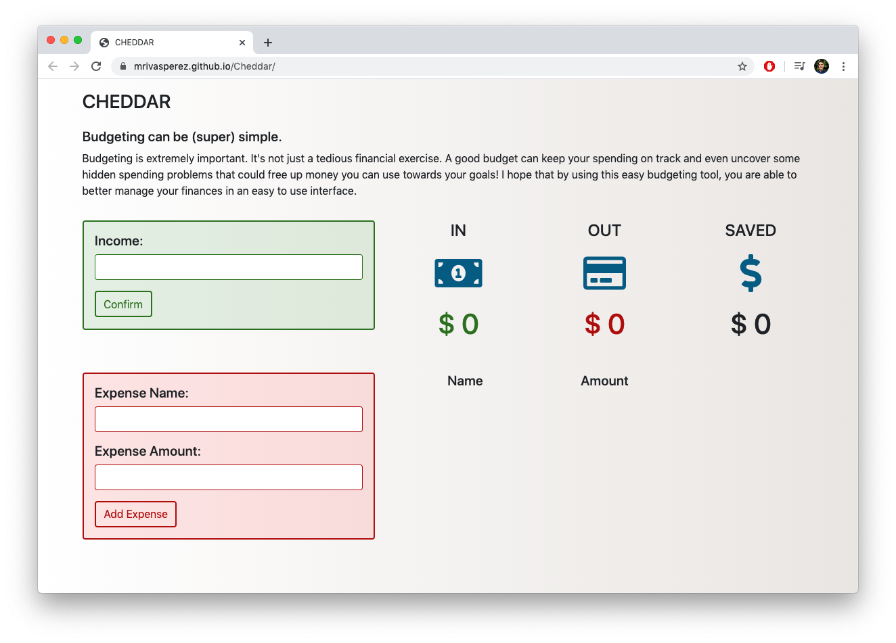

# Cheddar: A (super) Simple Budgeting App
by mrivasperez. live preview: <https://mrivasperez.github.io/Cheddar/>

## Screenshot

## Description
Cheddar is a super simple, dynamic web app designed to help people make their monthly, weekly, daily budget. I created while watching a code along on Coding Addict's YouTube channel. It is developed with HTML, CSS (custom sheets, Bootstrap 4.1.1), and Vanilla JS. 

## Installation
You can use this app in the live preview: <https://mrivasperez.github.io/Cheddar/> If you would prefer to load this webpage locally, you can download the files as a zipe file. Create a new folder in your system then drap and drop the contents of the zip file to that folder. Double click "index.html" to open the app.

## Usage
### Adding Income:
The user can reflect the amount of money they expect to receive by entering the numeric amount (without commas) into the green income box. The income will then be reflected under the "IN" column with a dollar bill icon. If the user does not enter an amount, or enters a negative number, they will be met with an error that lasts 3 seconds.
### Adding Expense
The user can add multiple expenses. The user enters and expense name and amount associate with that expense. Upon clicking "Add Expense" The expense(s) will be listed under the Name and Amount columns.
### Saving the budget
As part of the simple functionality of the budget app, it is not possible to save your budget for future use. If you would like to keep track of your spending, it is recommended that you print the page. Since this is a project I made for fun on a Friday night, I am unlikely to update it in the future. The only plans I have is to create better comments on the code.

## Credits
Coding Addict's YouTube channel: <https://www.youtube.com/codingaddict>
Font Awesome for graphics

## The Unlicense
This is free and unencumbered software released into the public domain.

Anyone is free to copy, modify, publish, use, compile, sell, or distribute this software, either in source code form or as a compiled binary, for any purpose, commercial or non-commercial, and by any means.

In jurisdictions that recognize copyright laws, the author or authors of this software dedicate any and all copyright interest in the software to the public domain. We make this dedication for the benefit of the public at large and to the detriment of our heirs and successors. We intend this dedication to be an overt act of relinquishment in perpetuity of all present and future rights to this software under copyright law.

THE SOFTWARE IS PROVIDED "AS IS", WITHOUT WARRANTY OF ANY KIND, EXPRESS OR IMPLIED, INCLUDING BUT NOT LIMITED TO THE WARRANTIES OF MERCHANTABILITY, FITNESS FOR A PARTICULAR PURPOSE AND NONINFRINGEMENT. IN NO EVENT SHALL THE AUTHORS BE LIABLE FOR ANY CLAIM, DAMAGES OR OTHER LIABILITY, WHETHER IN AN ACTION OF CONTRACT, TORT OR OTHERWISE, ARISING FROM, OUT OF OR IN CONNECTION WITH THE SOFTWARE OR THE USE OR OTHER DEALINGS IN THE SOFTWARE.

For more information, please refer to http://unlicense.org/
